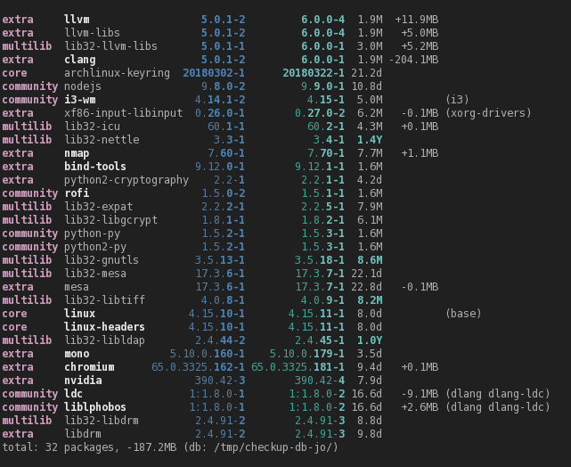
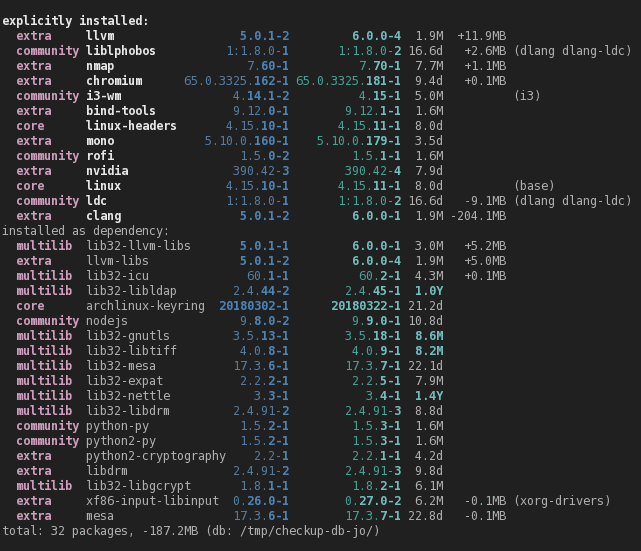

# pacpend

`pacman -Qu` output, but more customizable. Inspired by `VerbosePkgLists`, `yaourt -Qu`, and `pacaur -Qu`.

Can sort, group, highlights explicitly installed packages, query AUR database...

Uses `checkupdates` [safe temporary database](https://wiki.archlinux.org/index.php/System_maintenance#Partial_upgrades_are_unsupported) by default.

See `pacpend -h` to see all the options.

## Usage

Usage with `checkupdates` for safe update checking. (so better used in an alias or script.)

* Check updates:
  ``` shell
  $> checkupdates > /dev/null && pacpend
  ```

* Check and download only updates as user:

  * Setup once as root to give "download rights"
    (should be mostly safe for a personal computer: pacman checksums/verfies packages before install)
    ``` shell
    $> sudo chmod a+w /var/cache/pacman/pkg
    ```
  * Now, as a user you can safely **check and download updates**:
    ``` shell
    $> checkupdates > /dev/null; pacpend; \
       fakeroot -- pacman --noconfirm -Suwb "${TMPDIR:-/tmp}/checkup-db-${USER}/"
    ```

* Globally change pacpend default in your `.bashrc`/`.zshrc`/...:
  ``` shell
  export PACPEND='-g explicit -s name,vdiff'
  ```

## Screenshots

- `pacpend -g none -s name,vdiff`<br/>
  no groups, **sort by version difference/increment**:
  

- `pacpend -g explicit -s name,sizediff`<br/>
  group by explicitly installed or not, sort by installed size difference/increment:
  


## Dependencies

* archlinux
* python3
* [pyalpm](https://www.archlinux.org/packages/extra/x86_64/pyalpm/): Libalpm (pacman) bindings for Python 3
